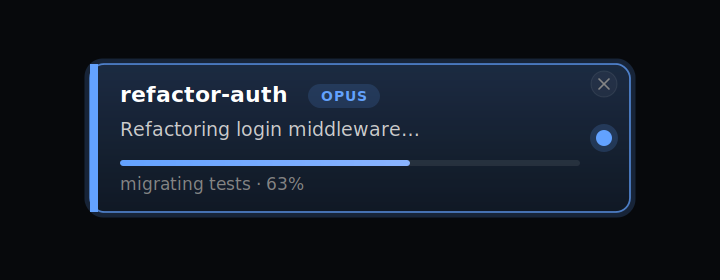
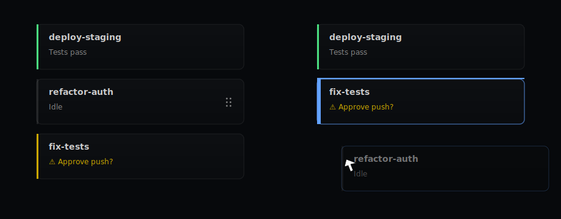
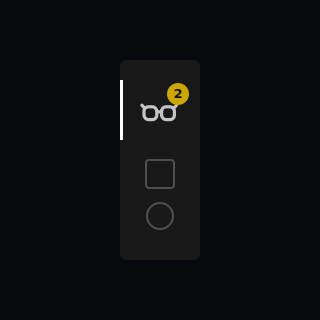
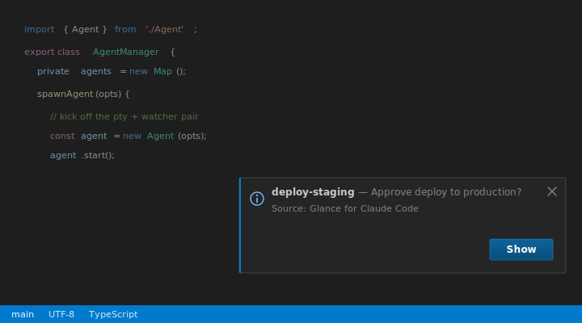

# Glance for Claude Code

Run multiple Claude Code sessions side-by-side in VS Code, with a live status card for each one.

[](https://marketplace.visualstudio.com/items?itemName=hamzawaleed.glance-claude-code)



Every agent runs in a real VS Code terminal. Each one reports its own title, one-line TL;DR, progress, and a flag when it's blocked on you — all on a card in the sidebar — so you can keep five sessions humming without losing track of which one needs you next.

## Install

From the **VS Marketplace**: [hamzawaleed.glance-claude-code](https://marketplace.visualstudio.com/items?itemName=hamzawaleed.glance-claude-code) — or in VS Code, open Extensions and search for **"Glance for Claude Code"**.

Requirements:

- VS Code 1.90+
- Claude Code (`claude` binary on `PATH`)
- A workspace folder open

Click the Glance icon in the activity bar to open the panel, then hit **+ New Session** (or `Cmd+Shift+G` / `Ctrl+Shift+G`).

## What you see

### Status cards driven by Claude itself

Glance ships a tiny MCP server and instructs Claude to call its `update_state` tool at the end of every turn. The tool's JSON payload lights up the card — no transcript parsing, no scraping shell output.



Five fields, sent on every call (pass `null` for what doesn't apply):

| Field | What it does |
| --- | --- |
| `title` | 2–4 word card title. AI sets it on the first turn; you can rename to lock it. |
| `tldr` | One short, speakable sentence summarizing the latest outcome. |
| `progress` | `{ value: 0..1, label: string }` for multi-step work; hidden on trivial turns. |
| `needsInput` | Short clause when the agent is waiting on you. Lights the card yellow. |
| `error` | Short clause when a hard failure blocks progress. Lights the card red. |

The card also tracks lifecycle automatically — turn-complete plays a tone, `/clear` and `/compact` reset the card, and Claude's idle "Notification" pings are ignored mid-stream so they don't false-positive the attention flag.

### Drag to reorder

Hold any card and drop it where you want it. Order persists across reloads.



### Attention badge on the activity bar

When any agent needs input or hits an error, the Glance icon in the activity bar shows a count badge — so you know to come back even when the sidebar is collapsed or you're in another panel.



### Toast when a turn finishes in the background

If you're not actively watching an agent when its turn completes, Glance fires a native VS Code information toast (plus a short tone) so the result reaches you without yanking focus. The toast carries the agent's name, the latest `tldr` or `needsInput` reason, and a **Show** button that jumps straight to that terminal.



The toast is suppressed when you're already looking at that agent's terminal, so you don't get pinged for work you're staring at.

### Sessions persist across reloads

Close VS Code, reopen it — your agents are still there. Reload-the-window doesn't kill them either. Cards render from the last known state immediately; clicking one **revives** the session via `claude --resume <sessionId>` only when you focus it, so dormant agents cost nothing.

(Agents you spawned but never prompted aren't persisted, since there's no transcript to resume from.)

### Per-agent model picker

The dropdown chevron next to **+ New Session** lets you choose Opus / Sonnet / Haiku per agent. The card shows a small chip with the active model.

## Keybindings

| Action | Shortcut |
| --- | --- |
| Focus panel | `Cmd+Shift+G` / `Ctrl+Shift+G` |
| New agent (panel focused) | `Cmd+Shift+G` / `Ctrl+Shift+G` |
| New agent (anywhere) | `Cmd+Alt+N` / `Ctrl+Alt+N` |
| Kill active agent | `Cmd+Backspace` / `Ctrl+Backspace` (panel focused) |
| Cycle agents | `↑` / `↓` (panel focused) |

Double-click a card title to rename it. Renames are sticky — AI updates won't overwrite a manual title until you `/clear` the session.

## Build from source

Package manager is **pnpm** (the postinstall step chmods `node-pty`'s `spawn-helper`, which the hoisted layout depends on — npm/yarn won't work).

```bash
git clone https://github.com/hamzawaleed0102/glancer-vscode.git
cd glancer-vscode
pnpm install
pnpm run build
code .
# Press F5 to launch the Extension Development Host.
```

`pnpm run watch` runs esbuild in watch mode for the extension host, the webview, and the test build.

### Tests

```bash
pnpm run test
```

Plain `node:test` files compiled by esbuild and executed against `out/`. To add a test file, list it in both `esbuild.config.mjs` (`testEntries`) and the `scripts.test` entry in `package.json`.

## How it fits together

Three runtimes cooperate per agent:

1. **Extension host** — owns the `node-pty` child per agent, a chokidar watcher on `state/<id>.json`, and a global watcher on the hook events directory. Owns persistence (`sessions.json` + `state/<id>.json`) and the activity-bar badge.
2. **VS Code pseudoterminal** — wraps the PTY so VS Code handles scrollback. A "Starting session…" placeholder is held until Claude's alt-screen escape arrives, so the launch command never leaks into terminal output.
3. **Webview (React)** — the sidebar UI. Communicates with the host over typed `postMessage` envelopes (see `src/shared/messages.ts`).

Two file-based pipelines run continuously:

- `glancer - update_state` (MCP tool) → `state/<id>.json` → chokidar → card. This is the marker path.
- `Stop` / `UserPromptSubmit` / `Notification` / `SessionStart` (Claude hooks) → `events/*.json` → chokidar → lifecycle state. This is the streaming / attention / clear path.

See [`CLAUDE.md`](./CLAUDE.md) for the in-depth tour, including the conventions around marker sanitization, dormant agents, and the focus-race retry logic on auto-spawn.

## License

MIT. See [`LICENSE`](./LICENSE).
